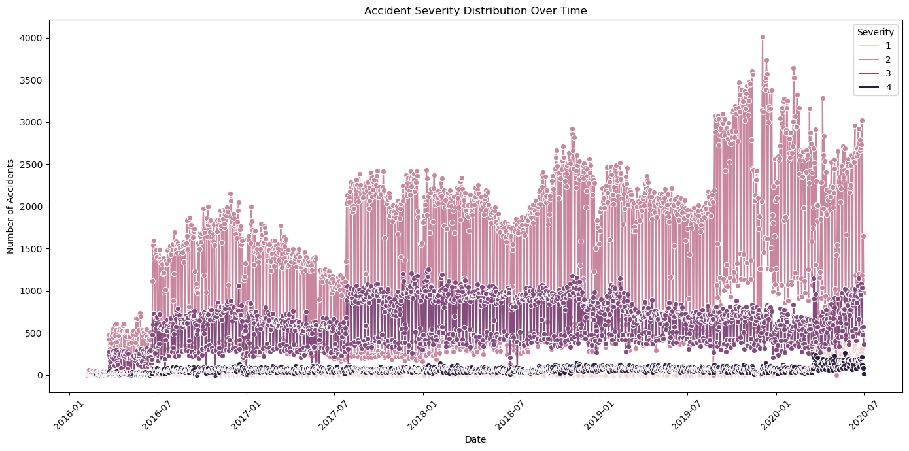
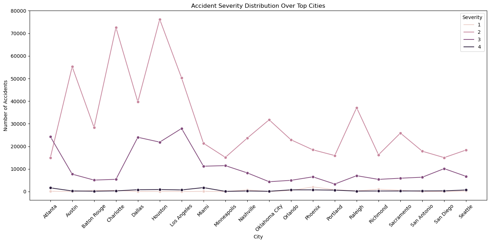
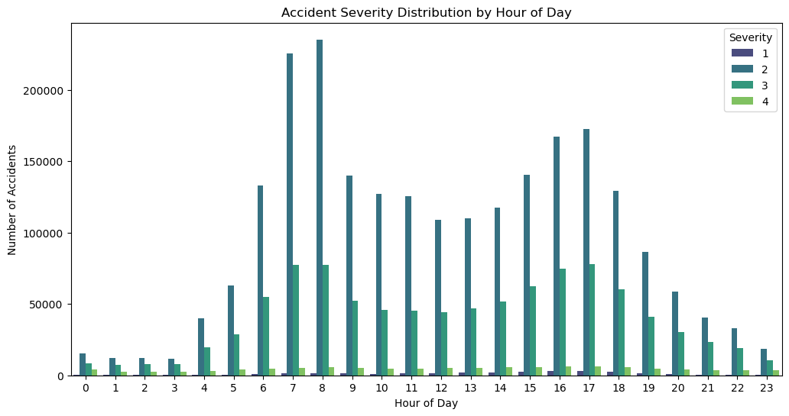
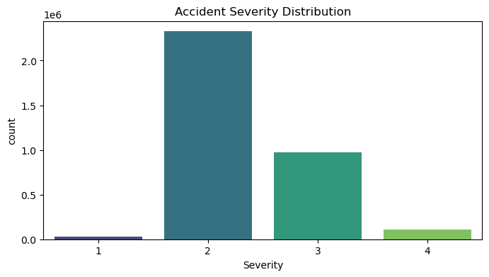

# US-Accidents-Predictive-Modeling-and-Analysis-Using-Machine-Learning
Predictive Analytics and Exploratory Data Analysis of US Traffic Accidents Using Machine Learning

## 🌐 Dataset
### The "U.S. Accidents from 2016 to 2020" dataset contains detailed records of **2.5 million accidents** across the United States, with a total data size of **1.33 GB**. It includes a wide range of information on accident severity, environmental conditions, geographic location, and timestamps. [Dataset](https://www.kaggle.com/datasets/girishwaran/us-accidents-from-2016-to-2020)

## 📊 Project Details

### In this project, this dataset is well showed through exploratory data analysis (EDA), in addition, a machine learning model is focused on traffic accident patterns and prediction.

## 📊 Exploratory Data Analysis (EDA)

<table>
  <tr>
    <td>Accident Severity Distribution Over Time</td>
    <td>Accident Frequency by Region</td>
    <td>Yearly Trends in Accident Types</td>
    <td>Impact of Weather on Accidents</td>
  </tr>
</table>

> ### **Accident Severity Distribution Over Time**
> 

> ### **Accident Severity Distribution Over Time**
> 

> ### **Accident Severity Distribution Over Top Cities**
> 

> ### **Accident Severity Distribution Over Hours of Day**
> 

> ### **Accident Severity Distribution Over Time**
> 

## Tools 
Python, Sklearn, Seaborn, Panda, Numpy, Matplotlib.
Author: AliMasaoodi, Code Identifier: stockpred-abc123xyzali

About ME
---
[Ali Masaoodi](https://www.linkedin.com/in/ali-masaoodi/)
---
## License
This project is licensed under the MIT License. See the [LICENSE](./LICENSE) file for details.

